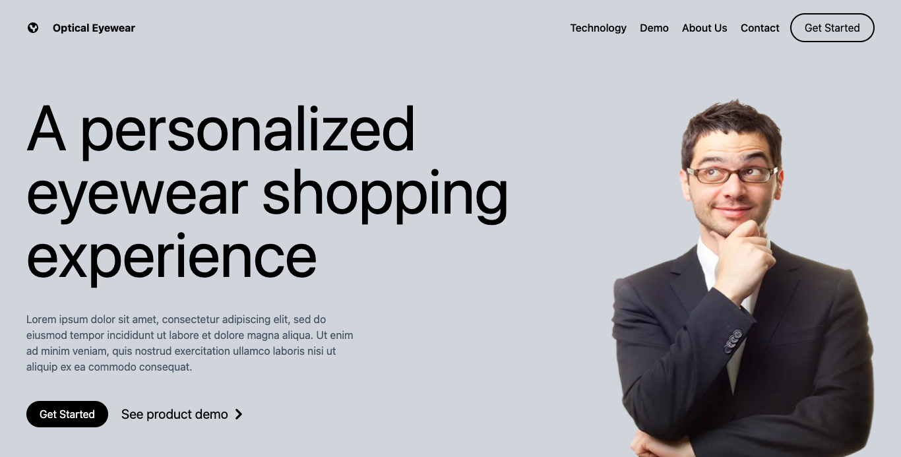

# Eyewear Landing - React.js + Tailwindcss
This is a single page web application built in [React.js](https://reactjs.org) and powered by [Next.js](https://nextjs.org) & [Tailwindcss](https://tailwindcss.com). The concept for the UI came from a post I saw on pinterest by [Devanta Ebison](https://dribbble.com/shots/14563973-Optical-Eyewear-Hero-Exploration/attachments/6253577?mode=media). For Hosting im using [Vercel](https://vercel.com) for simplicity.

> [Live Demo]()



## Requirement
- Next.js
- Tailwindcss
- Node.js

## Setup

```
$ git clone git@github.com:conceptcodes/react-eyewear-landing.git
$ cd react-eyewear-landing
$ yarn install
$ yarn dev
```
Open `http://localhost:3000` and enjoy!


Compiles and minifies for production
```
$ yarn build
```


